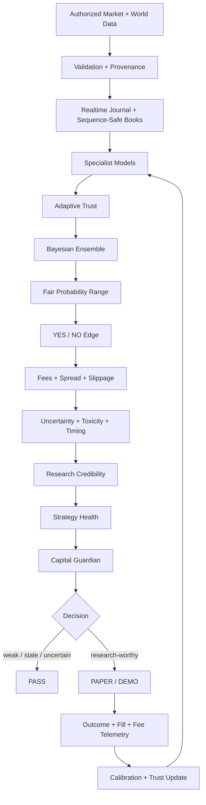
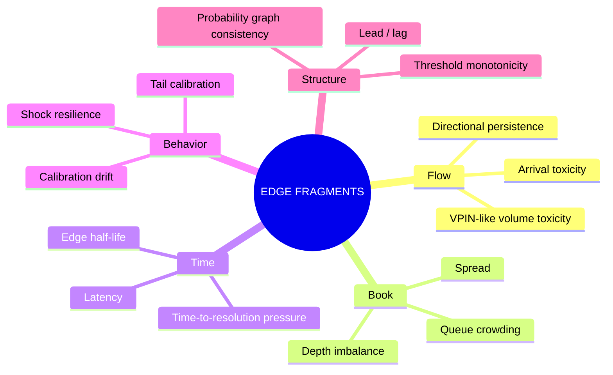
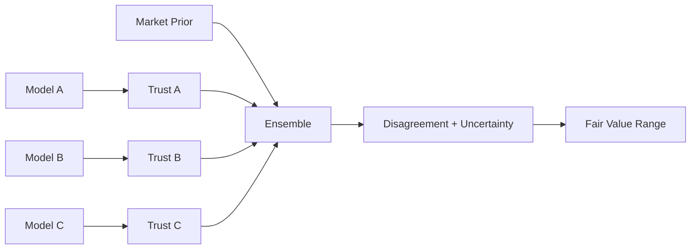
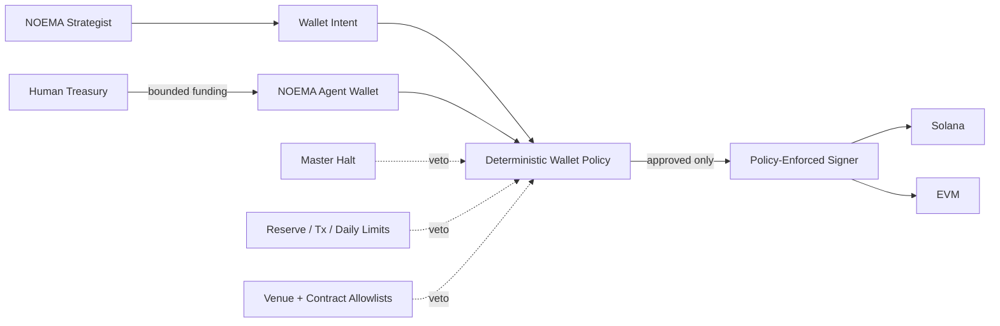

<div align="center">

# NOEMA //

### Observe. Infer. Verify. Act.

**A calibrated autonomous market-intelligence system for prediction markets, realtime microstructure research, and bounded multichain agents.**

[](https://www.python.org/)
[](https://github.com/gryszzz/NOEMA/actions)


**Evidence → Belief → Edge → Restraint**

</div>

---

## What is NOEMA?

NOEMA is an autonomous forecasting and market-research stack built around one idea:

> **A model is not allowed to call itself smart. It has to prove it.**

The system continuously gathers market data, preserves evidence, forms probabilistic beliefs, compares those beliefs with executable prices, measures uncertainty and execution quality, rejects weak opportunities, and scores itself after resolution.

It is designed to become more selective as it becomes more capable.

Most markets should end in **PASS**.

## System map



## Current stack

| Layer | What NOEMA does |
| --- | --- |
| **Truth** | Evidence IDs, payload hashes, source authority, stale/future-data rejection |
| **Realtime** | WebSocket capture, receipt timestamps, sequence-aware local books, latency metrics |
| **Forecasting** | Market prior, specialist probabilities, Bayesian/log-odds ensemble |
| **Self-critique** | Model disagreement, skeptic logic, multiple-testing/search penalties |
| **Calibration** | Brier score, log loss, ECE, tail calibration, drift detection |
| **Microstructure** | Spread, liquidity, queue crowding, toxicity, shock resilience, lead/lag |
| **Timing** | Quote freshness, latency, edge persistence, price-shock rejection |
| **Execution truth** | Fills, fees, maker/taker mix, partial fills, reconciliation |
| **Survival** | Drawdown stops, exposure caps, reserve floor, loss quarantine, master halt |
| **Ops** | Browser dashboard, Opportunity Radar, account telemetry, model-trust view |
| **Wallet foundation** | Multichain intents, policy gate, daily budget, provider-neutral signer |

## Opportunity Radar

The Ops Console contains an expandable **Research Attention Radar**.

Each market can expose:

```text
model probability
market probability
executable ask
raw edge
estimated cost
uncertainty penalty
robust edge
spread
liquidity
freshness
forecast width
evidence IDs
decision
exact PASS / attention reason
```

The radar ranks **research attention**, not guaranteed trades.

Automatic attention scoring is suppressed for obvious election/political contract titles.

## Edge-fragment laboratory

NOEMA includes small diagnostics that can be measured independently and deleted if they do not add value.



These are hypotheses, not alpha declarations.

The lifecycle is:

```text
hypothesis
  -> collect
  -> replay
  -> walk-forward test
  -> incremental-value test
  -> KEEP / THROTTLE / DELETE
```

## Strategist

NOEMA does not average a pile of agents and call it intelligence.

Specialists earn influence.



A model can lose influence when:

- recent calibration deteriorates;
- Brier/log-loss stops beating transparent baselines;
- out-of-sample performance weakens;
- drawdown breaches strategy policy;
- a formerly useful signal decays.

See [docs/strategist.md](docs/strategist.md).

## Truth + timing

NOEMA treats hallucination as a systems problem, not a prompting problem.

A factual AI claim must resolve to stored evidence.

```text
CLAIM
  -> evidence ID
  -> source
  -> observed timestamp
  -> retrieval timestamp
  -> payload hash
  -> integrity / freshness gate
```

Realtime market books also fail closed on sequence gaps.

See [docs/truth-timing.md](docs/truth-timing.md).

## NOEMA // OPS

Run the browser console:

```bash
noema-dashboard
```

Open:

```text
http://127.0.0.1:8787
```

The console can display:

- exchange-reported realized P&L;
- fees;
- orders, fills and positions;
- reconciliation status;
- model trust;
- data health;
- resolved-market coverage;
- evidence/realtime counts;
- Opportunity Radar;
- research diagnostics.

The UI deliberately separates **observed**, **derived**, **model**, and **research** values.

## Agent wallet architecture

The long-term goal is autonomous action without handing unlimited authority to one process.



### Treasury vs agent

**Treasury / human wallet**

- long-term funds;
- deposits/withdrawals;
- recovery;
- user-visible wallet such as Phantom;
- never exposes its seed to NOEMA.

**NOEMA agent wallet**

- intentionally small operating balance;
- autonomous only inside pre-authorized limits;
- separate signer/provider;
- replaceable;
- hard policy boundaries.

Current code includes:

- wallet roles/providers;
- Solana/EVM/Bitcoin-capable chain descriptors;
- structured wallet intents;
- deterministic policy evaluation;
- daily notional accounting;
- evidence requirement;
- reserve/slippage/size caps;
- provider-neutral signer interface;
- fail-closed disabled signer by default.

See [docs/agent-wallet.md](docs/agent-wallet.md).

## Multichain direction

The future multichain research engine is not intended to be a blind meme-coin sniper.

It should ask:

```text
Is the move real?
Is the liquidity real?
What venue moved first?
What is the executable route?
What is the price impact?
What are gas / priority costs?
Is order flow toxic?
Is the edge already decaying?
Does the route violate wallet policy?
```

Potential adapters:

- Solana DEX routing;
- EVM DEX routing;
- cross-venue reference prices;
- on-chain flow;
- bridge-cost/latency research;
- volatility/regime models.

Every chain/venue remains an isolated adapter behind the wallet policy.

## Demo soak lab

Build a replayable dataset:

```bash
noema soak-once --limit 100
noema soak-loop --interval 60
noema soak-report
noema sync-outcomes --limit 2000
noema evaluate
```

The long-running worker records normalized snapshots, invalid observations, heartbeats and resolved outcomes.

See [docs/soak-lab.md](docs/soak-lab.md).

## Execution telemetry

Authenticated read-only telemetry:

```bash
noema account
noema telemetry
```

NOEMA can reconcile:

- exchange-reported order fill counts;
- raw fill records;
- partial fills;
- maker/taker mix;
- actual fee cost;
- position-level fees;
- realized P&L.

See [docs/execution-telemetry.md](docs/execution-telemetry.md).

## Kalshi

The current venue stack includes:

- market discovery;
- binary quote normalization;
- resolution rules;
- authenticated orderbook reads;
- WebSocket ingestion;
- market-history/outcome sync;
- account telemetry;
- queue position observation;
- demo/production separation.

See [docs/kalshi-core.md](docs/kalshi-core.md).

## Modes

```text
RESEARCH
  ingest -> replay -> forecast -> evaluate

PAPER / DEMO
  live data -> forecast -> policy -> simulated/demo behavior -> score

PRODUCTION
  intentionally gated behind explicit credentials, wallet/venue policy,
  survival controls, current API verification and human-controlled limits
```

## Repository principles

1. **No fabricated inputs.**
2. **No lookahead.**
3. **Probability before position.**
4. **Evidence before narrative.**
5. **Risk is deterministic.**
6. **Unknown state fails closed.**
7. **Forecasts are immutable.**
8. **Execution costs are measured.**
9. **Models earn trust.**
10. **Survival outranks activity.**

## Development

```bash
python -m venv .venv
source .venv/bin/activate
pip install -e ".[dev]"

ruff check .
pytest -q
```

## Project status

```text
forecasting core          ██████████
Kalshi data stack         ██████████
replay / evaluation       ██████████
adaptive strategist       ██████████
truth / provenance        ██████████
execution telemetry       ██████████
Ops Console / radar       ██████████
agent-wallet policy       ███████░░░
multichain adapters       ██░░░░░░░░
mainnet autonomy          ░░░░░░░░░░
```

The unfinished pieces are intentionally unfinished until they can be validated against real provider/venue behavior.

---

<div align="center">

### NOEMA //

**Observe reality. Form beliefs. Measure edge. Protect capital.**

Research software for uncertain markets. No strategy, model, or automation can guarantee profit.

</div>
