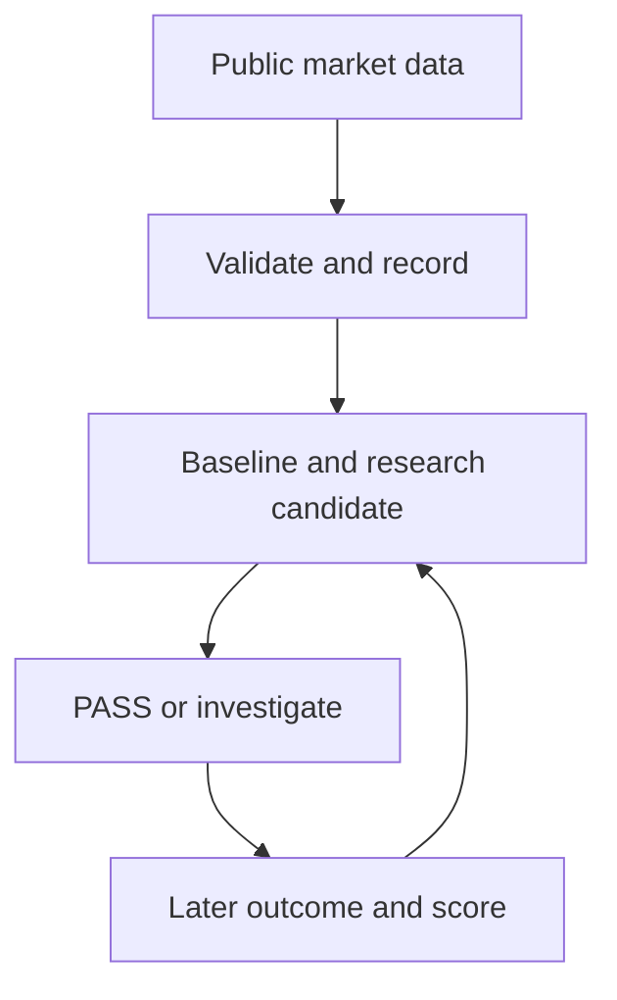

<div align="center">


[](https://www.python.org/)
[](https://github.com/gryszzz/NOEMA/actions)


**Calibrated market intelligence and an evolving agent life engine for event-driven markets.**

</div>

NOEMA watches markets, records time-stamped forecasts, checks its ideas against
later outcomes, and shows its reasoning and operating costs in an Ops Console.
Its long-term vision includes an agent EVM economy: a dedicated wallet, bounded
budgets, and the ability to fund its own operation if real results support it.
Today, that economy is a policy and observation foundation. NOEMA earns greater
autonomy through measured performance; an interesting model answer is not proof
of an edge.

> **Current mode:** autonomous **paper research**. Live orders and automatic bill
> payment are not part of the running worker. Profitable operation has not been proven.

## Start here

Requires Python 3.12+. From a fresh checkout:

```bash
python -m venv .venv
source .venv/bin/activate
pip install -e ".[dev]"

noema agent-once   # collect one public-market research cycle
noema ladder       # see observed progress and the next evidence gate
noema doctor       # check optional connections, without revealing secrets
```

The first cycle needs network access to the public Kalshi API. It does **not**
need a Kalshi login, wallet, or paid language model. Invalid or unavailable data
stays unavailable; a successful process exit alone does not prove useful forecasts.

Run the agent continuously and open the local console in separate terminals:

```bash
noema-agent
```

```bash
noema-dashboard
# Open http://127.0.0.1:8787
```

The dashboard binds to localhost by default. To connect optional Kalshi account
observation, a dedicated **public** EVM address, or Microsoft Foundry cognition,
run `noema setup` and then `noema doctor`. Keep private keys and seed phrases out
of NOEMA. See the [setup guide](docs/quick-connect.md).

## What the agent actually does

| Stage | Current behavior | Evidence of progress |
| --- | --- | --- |
| Observe | Collects bounded public Kalshi snapshots, rotating through API pages across cycles, and validates them. | Agent cycle and data-health status |
| Forecast | Records the YES ask for execution review and a valid bid/ask midpoint for forecast scoring. After enough earlier settled events in a comparable series, it can add an independent, exploratory frequency candidate. | Forecast ledger with timestamps and evidence |
| Research | Ranks markets for attention and can ask a configured Foundry model to review eligible evidence. | Research packet and stated reasons to investigate or pass |
| Score | Syncs later outcomes and compares independent candidates with the baseline from the same snapshot. | Paired Brier comparison and calibration reports |
| Paper execution | Tests a new candidate against public best-quote size (or authenticated book depth if configured) and event-specific taker fees; records one hypothetical quote. | Settlement-only paper net-return audit |
| Budget | Shows the estimated monthly bill and manually recorded cash receipts/expenses; caps estimated model calls. | Operating Bill view and budget reservations |

The independent candidate requires at least **30 previously observed, settled,
homogeneous events** in a series. It is exploratory and **PASS-only**. The
language model reviews evidence; its prose is not a market probability or an
order instruction. Most markets should end in **PASS**.



To inspect scored results after contracts resolve:

```bash
noema sync-outcomes --limit 2000
noema evaluate
noema compare
noema paper-audit
```

`noema compare` reports distinct, paired settled markets; it does not turn a
positive sample into permission for live trading. See
[evaluation](docs/evaluation.md) and [the evidence ladder](docs/real-life-ladder.md).

The worker records a paper quote for each **new** eligible independent candidate
if the public best bid/ask, displayed size, fee terms, and forecast freshness
pass validation. A configured Kalshi API key can provide full orderbook depth;
it is optional for small top-of-book paper quotes. To inspect a fresh candidate
manually, run `noema paper-quote MARKET-TICKER --contracts 1` within 30 seconds
of its forecast. `noema paper-audit` scores only paper quotes recorded before
later observed settlement. No order is submitted. A quote based on displayed
depth does not prove an order would have filled. See [evaluation](docs/evaluation.md).

## Agent ecosystem

NOEMA now coordinates persistent specialist profiles through a research-only ecosystem kernel.
New specialists receive bounded exploration, proven research can earn more attention, quarantined
specialists receive none, and one family cannot silently consume the whole research loop.
The current runtime bootstraps Kalshi paper research and Trench-1 shadow research and records the
dominant specialist in each agent cycle.

This allocates research attention only; it does not move money or relax wallet limits. See
[Agent ecosystem](docs/agent-ecosystem.md).

## Evolution loop

NOEMA now reviews specialist maturity from new forward evidence rather than static labels.
Unchanged evidence cannot advance streaks. Clean repeated reviews can promote research maturity;
repeated soft failures downshift it; hard research/risk failures quarantine immediately.
Measured weaknesses can register bounded challenger experiments in the immutable research-trial
ledger.

Inspect it with `noema ecosystem-show` or the `/api/ecosystem` endpoint. See
[Specialist evolution](docs/specialist-evolution.md).

## Trench-1: first crypto specialty

NOEMA now has a narrow, research-only Solana new-token layer instead of a generic
"trade every coin" mandate. Trench-1 records early price/liquidity/flow growth,
holder concentration, token-control risk, Jupiter organic activity, rejected-token
counterfactuals, research-trial counts, purged walk-forward folds, PSR, and PBO.

It produces `quarantine`, `observe`, or `research_candidate` -- never a live
BUY/SELL instruction. Read [Trench-1](docs/trench-1.md) for the evidence base,
data contract, training ladder, and promotion rules.

## Continuous Trench collection

The Trench-1 specialist can now accumulate time-honest Solana launch trajectories inside the
persistent NOEMA runtime. It stores discovery, successful snapshots, failed attempts, the fixed
five-minute research assessment, and later counterfactual outcomes. Missing/stale horizons are
never backfilled with newer data.

Collection is off by default. Set `NOEMA_TRENCH_ENABLED=1` after configuring the read-only data
connections. Inspect with `noema trench-show` or `GET /api/trench`. See
[Trench-1](docs/trench-1.md).

## Trench Survival-v1

Once enough five-minute to one-hour labels accumulate, NOEMA automatically audits a regularized
logistic survival model against a constant historical survival-rate baseline. Training is
chronological and only uses labels that were actually known before each test prediction.
A successful audit can unlock future paper forecasts, never live execution.

Inspect with `noema trench-model-audit`.

## Keep the project affordable

The repository's `render.yaml` defines **one paid paper worker with a persistent
disk**. It does not expose the dashboard as a public URL. Check the actual
service and disk price in your Render workspace before deploying it.

Set a monthly estimate and the amount you are willing to cover personally:

```bash
noema bill-config --hosting 7 --other 1 --model-budget 0 --owner-limit 10
noema bill-show
```

Those numbers are **examples, not a price quote**. `--other` includes expected
model/API spend and any other operating services; `--model-budget` must fit
inside it. Paid model calls stay idle without a positive monthly model budget,
and their worst-case estimates reserve against both daily and monthly limits.

Record actual invoices and **settled cash** only when they exist:

```bash
noema bill-entry --kind expense --amount 7.25 --source render --reference invoice-2026-09
noema bill-entry --kind receipt --amount 3 --source settled-payout --reference payout-2026-09
```

The reference prevents the same entry from being counted twice. Entries are
operator-reported; the dashboard compares them with the monthly estimate and
warns if estimated owner exposure exceeds the configured limit. **This is an
advisory ledger, not a payment processor or a provider-side spending limit.**
Paper P&L, account deposits, and internal capital allocations are not cash
receipts. Set billing controls with providers as well. Read the
[hosting and bill guide](docs/hosting-paper-agent.md).

## What remains to be earned

| Capability | State now | Gate before promotion |
| --- | --- | --- |
| Continuous market observation | Implemented in `noema-agent`; hosting must be separately deployed and checked. | Healthy recurring cycles, outcome sync, persistent backup |
| Independent forecasting | Exploratory historical-series candidate; PASS-only. | Enough later-resolved, paired out-of-sample events and improvement over baseline |
| Model research | Optional Foundry connection, evidence and spending gates. | Better reviewed research quality for its cost |
| EVM economy | Public-address observation, wallet policy and disabled signer foundation. | Authorized adapter, bounded signer, reconciliation and explicit live review |
| Live execution | Locked by default. | Venue rules, real after-cost evidence, deterministic risk checks and human-controlled limits |
| Paying its bill | Operator-reported cash tracking and model budget limits. | Verified recurring receipts exceeding actual full operating costs |

NOEMA does not create tokens, generate volume, place live trades from an LLM
decision, sign with your personal wallet, or charge a payment method by itself.
The Economic OS tracks capital buckets and earned autonomy as **internal
accounting**, without moving money. [Economic OS details](docs/economic-os.md).

## Find your way around

| Goal | Where to go |
| --- | --- |
| Connect credentials without committing them | [`noema setup`](docs/quick-connect.md) |
| Understand one agent cycle and heartbeat | [Agent runtime](docs/agent-runtime.md) |
| Inspect the Ops Console and Opportunity Radar | `noema-dashboard` and [agent runtime](docs/agent-runtime.md) |
| Compare forecasts without lookahead | [Evaluation](docs/evaluation.md) |
| Build an independent model and challenge it | [Custom LLM](docs/custom-llm.md) and [strategist](docs/strategist.md) |
| Understand EVM wallet boundaries | [Agent wallet](docs/agent-wallet.md) |
| Host the paper worker | [Render guide](docs/hosting-paper-agent.md) |
| Contribute safely | [`AGENTS.md`](AGENTS.md) and [architecture](docs/architecture.md) |

## Development

```bash
ruff check .
pytest -q
```

NOEMA uses official or authorized APIs, preserves evidence timestamps, and
fails closed on missing data. New venues, models and strategies begin in paper
mode. No strategy, model or automation can guarantee profit.

## Meridian + NOEMA integration

The first file-based evidence-review bridge connects the two independent repositories.
It exports a Meridian source excerpt, produces an offline NOEMA evidence checklist,
and imports that review as analysis. It does not yet run an autonomous investigation.
See the [shared vision](docs/meridian-noema-vision.md) and
[transfer contract and walkthrough](docs/meridian-noema-contract.md).
