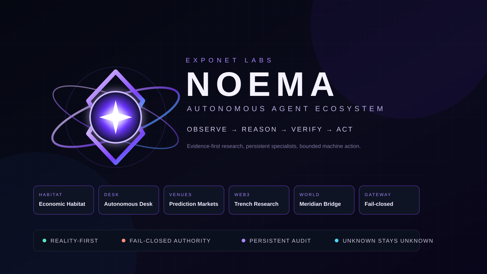
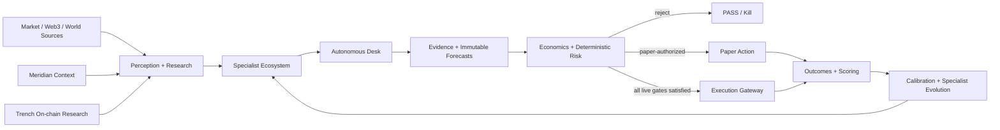
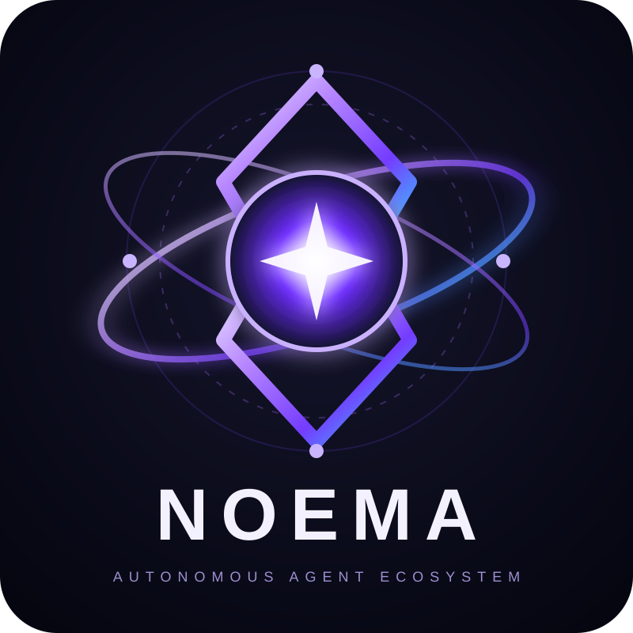

<div align="center">



<br />

# NOEMA

### Observe. Infer. Verify. Act.

**An evidence-first autonomous agent ecosystem for economic intelligence, prediction markets, Web3 research, and bounded machine action.**

[](https://github.com/gryszzz/NOEMA/actions/workflows/verify.yml)


[Public experience](https://gryszzz.github.io/NOEMA/) ·
[Quick start](docs/quick-connect.md) ·
[Operator guide](docs/operator-guide.md) ·
[Architecture](docs/architecture.md) ·
[Economic Habitat](docs/economic-habitat.md) ·
[Brand](docs/brand.md) ·
[Meridian](https://github.com/gryszzz/Meridian-Intel)

</div>

---

## The mission

NOEMA is built around a simple rule:

> **Increase autonomy only when evidence, economics, and authority boundaries can support it.**

The system observes markets and other public information, records forecasts and research state, evaluates later outcomes chronologically, allocates bounded research attention across specialists, and exposes the resulting system as an auditable operating world.

The long-term direction is broader than a trading bot: NOEMA is an **agent economy and intelligence runtime** that can turn observed information into structured research, bounded decisions, and eventually real-world action — without hiding uncertainty or silently expanding its own authority.

## Reality-first status

NOEMA separates **implemented capability** from **future authority**.

| Layer | Current repository state |
| --- | --- |
| Research runtime | Persistent specialist ecosystem, bounded research attention, missions, experiments, evidence, immutable forecasts, and outcome evaluation |
| Cognition | Optional model-assisted reasoning behind explicit configuration and budget gates |
| Prediction markets | Kalshi and Polymarket integrations for market/account observation where configured; paper research remains the default operating mode |
| Web3 | Trench research path for on-chain discovery and forward evidence collection |
| Meridian | Frozen request/review bridge for world-intelligence context; no always-on shared service is implied |
| Economic OS | Cash, reservations, costs, budgets, measured outcomes, and reconciliation rules remain distinct |
| Wallets | Observed wallet/network state can be surfaced; visibility never grants signing or transfer authority |
| Execution | Deterministic gateway exists and is **fail-closed by default**; a visible gateway is not proof of live trading |
| Ops Console | Runtime-backed Economic Habitat, inspectors, replay, live capital surfaces, work packets, and Autonomous Desk |
| Public site | Static documentation/report explorer; it is not the private worker or authority surface |

**Paper results are not revenue. Wallet observations are not authority. Missing state stays missing.**

See [Economic integrity](docs/economic-integrity.md) and [Production boundaries](docs/production-boundaries.md).

## A living operating system

NOEMA's console is no longer just a table of records. It projects canonical runtime state into a spatial operating world.

### Economic Habitat

The habitat organizes real entities into functional zones:

- **Cognition Array** — model and data providers
- **Agent Colony** — registered specialists and handoff participants
- **Mission Control** — persisted active missions
- **Market Deck** — markets and immutable forecasts
- **Evidence Vault** — evidence, sessions, experiments, lessons, and recorded outputs
- **Treasury & Gateway** — wallets, runtime tools, policy, and execution boundary

Agents move or light rooms only when persisted assignments, handoffs, or mission relationships support the visualization. Historical replay hides later/current-only state.

### Autonomous Desk

Phase 3 adds an auditable, single-responsibility desk model:

```text
CHIEF → SCOUT → MAP / CONTEXT → VET → ODDS → SIZE → EXECUTION → RISK / EXIT
```

These are **presentation roles over canonical entities**, not magically-created agents. If NOEMA cannot defensibly bind a real registered specialist or tool to a seat, the seat stays:

```text
VACANT / UNBOUND
```

Active Work Packets reconstruct mission routes from exact assignments and persisted handoffs. The Shift Tape reuses NOEMA's canonical event timeline.

Read the full contract in [Economic Habitat](docs/economic-habitat.md).

## System architecture


```mermaid
flowchart LR
    A[Market / Web3 / World Sources] --> B[Perception + Research]
    M[Meridian Context] --> B
    T[Trench On-chain Research] --> B

    B --> C[Specialist Ecosystem]
    C --> D[Autonomous Desk]
    D --> E[Evidence + Immutable Forecasts]
    E --> F[Economics + Deterministic Risk]

    F -->|reject| P[PASS / Kill]
    F -->|paper-authorized| Q[Paper Action]
    F -->|all live gates satisfied| G[Execution Gateway]

    Q --> H[Outcomes + Scoring]
    G --> H
    H --> I[Calibration + Specialist Evolution]
    I --> C
```

The graph describes flow, not current live authority. The execution gateway remains separately gated and fail-closed.

## What makes NOEMA different

**Evidence over theater.** The UI is allowed to look alive only when canonical state supports it.

**Bounded specialists.** Research attention is allocated across specialist families instead of assuming one universal model should do everything.

**Chronological evaluation.** Forecasts are recorded before outcomes and scored later; winning streaks are not promotion criteria.

**Economic honesty.** Model/API/compute costs, cash, reservations, paper outcomes, and reconciled economic value remain separate concepts.

**Deterministic authority.** Model output can propose; deterministic policy governs whether action is even eligible.

**Restraint is valid.** NOEMA may leave capital, compute, or attention unused when nothing clears the evidence threshold.

## Roadmap

| Phase | State | Direction |
| --- | --- | --- |
| **01 · Reality-first console** | ✅ Implemented | Evidence-backed operations view, replay, diagnostics, economics |
| **02 · Living habitat** | ✅ Implemented | Inhabitants, workstations, mission occupancy, handoffs, recorded outputs |
| **03A · Autonomous Desk** | ✅ Implemented | Responsibility seats, active work packets, shift tape; seats remain unbound without a real capability |
| **03B · Rule Rack / Kill Board / Shift Report** | ⏭ Next | Surface enforced rules, rejected opportunities and their evidence, and persistent shift reports |
| **03C · Continuous operation and recovery** | 🔧 In progress | Source-controlled mirror, complete export, and fresh SQLite restore are implemented and locally tested; hosted recovery drill and uninterrupted-cycle proof remain outstanding |
| **03D · Economic reconciliation and measured edge** | ◌ Proposed | Close provider-cost coverage gaps and mature prospective Kalshi/Trench evaluation before measured evidence influences bounded allocation |
| **04 · Policy-gated execution** | 🔒 Gated | Only after explicit authority, supported adapters, budgets, evidence, and reconciliation |
| **05 · Real-world autonomous impact** | ◌ Vision | Expand from research loops into legitimate external work with the same audit discipline |

The roadmap is directional. It does **not** grant execution authority or claim profitability.

## Start with one cycle

Python 3.12+, from a checkout:

```sh
python -m venv .venv
source .venv/bin/activate
pip install -e ".[dev]"

noema agent-once
noema doctor
noema ladder
```

Run the continuous paper worker:

```sh
noema-agent
```

Run the private/local Ops Console:

```sh
noema-dashboard
# http://127.0.0.1:8787
```

Public observation paths may require network access. Optional providers, authenticated account observation, cognition, and hosted services require their own configuration. See [Quick connect](docs/quick-connect.md).

## Inspect the economics

```sh
noema economics-report > economics-report.json
```

The public explorer can import that report locally in the browser. The importer checks consistency; it does not authenticate a runtime or prove receipts.

Full net economic profit remains **unknown** until the relevant costs, transfers, balances, and realized outcomes are reconciled.

## Build and verify

```sh
ruff check .
pytest -q

npm ci
npm run site:test
npm run ops:test
npm run site:build

npx playwright install chromium
npm run site:qa
npm run ops:qa
```

The repository's **NOEMA Verify** workflow runs the Python suite, Node contracts, static-site build, and production browser QA on changes.

## NOEMA + Meridian

NOEMA and [Meridian](https://github.com/gryszzz/Meridian-Intel) have separate responsibilities.

**Meridian** organizes world evidence, entities, relationships, events, and timelines.

**NOEMA** consumes frozen research context, performs bounded economic research, records forecasts/decisions, evaluates outcomes, and enforces its own authority/economic boundaries.

The bridge is intentionally explicit and hash-bound. Meridian context does not become an order merely because NOEMA can read it.

See [Meridian ↔ NOEMA contract](docs/meridian-noema-contract.md).

## Repository map

| Area | Purpose |
| --- | --- |
| `noema/` | Python runtime, research, economics, venue/wallet observation, mission and persistence logic |
| `noema/static/` | Private Ops Console and runtime-backed habitat UI |
| `site/` | Static public experience and local report explorer |
| `docs/` | Architecture, operating contracts, evidence/economic boundaries, setup |
| `tests/` | Python + Node regression and truth-contract tests |
| `scripts/` | Browser QA and build/verification tooling |
| `render.yaml` | Hosted deployment blueprint/configuration; configuration is not proof of current deployed health |

## Read next

- [Master mission](docs/master-mission.md)
- [Economic Habitat + Autonomous Desk](docs/economic-habitat.md)
- [Agent ecosystem](docs/agent-ecosystem.md)
- [Live workstation](docs/live-workstation.md)
- [Economic integrity](docs/economic-integrity.md)
- [Prediction venues](docs/prediction-venues.md)
- [Trench-1](docs/trench-1.md)
- [Agent wallet](docs/agent-wallet.md)
- [Production boundaries](docs/production-boundaries.md)
- [Brand system](docs/brand.md)

---

<div align="center">



**Evidence → Belief → Edge → Restraint**

<sub>NOEMA is an experimental research and agent-runtime project. Nothing in this repository is a guarantee of profit, a promise of self-funding, or automatic authorization to place orders or move funds.</sub>

</div>
