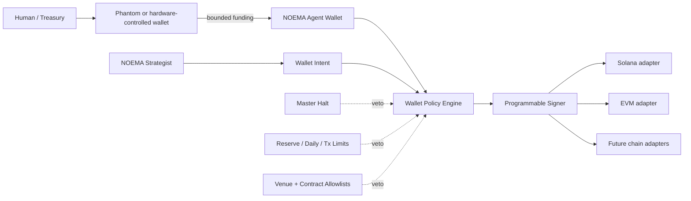
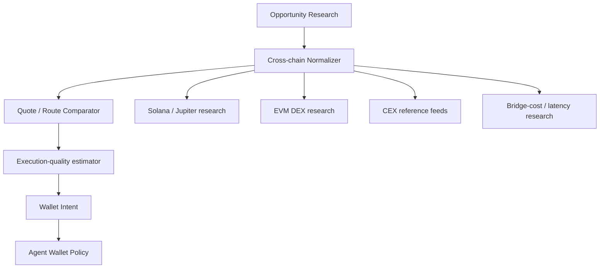

# NOEMA Agent Wallet Architecture

NOEMA should never use the owner's primary wallet seed as an unattended trading credential.

The recommended topology separates human treasury control from autonomous operating capital.



## Two-wallet model

### Treasury wallet

Purpose:

- human custody;
- deposits and withdrawals;
- long-term balances;
- emergency recovery;
- funding the agent wallet;
- receiving profits.

A Phantom wallet can serve this role well because it is visible to the user on desktop/mobile and supports multiple networks.

NOEMA does **not** need the treasury seed phrase.

### Agent wallet

Purpose:

- hold only bounded operating capital;
- sign transactions requested by NOEMA;
- enforce restrictions independently of the strategy;
- be replaceable without affecting treasury custody.

A programmable server-wallet provider with a policy engine is a better fit than exporting a Phantom private key into a server process.

## Why a programmable signer

The strategy and the signer should not share authority.

NOEMA may decide:

> swap $18 USDC into SOL on an allowlisted venue

but the signer should independently reject it when:

- the chain is not allowlisted;
- the venue is not allowlisted;
- the contract/program is unknown;
- size exceeds the per-transaction cap;
- daily turnover is exhausted;
- estimated slippage is too high;
- required reserve would be violated;
- no evidence references support the intent;
- the master halt is active.

This is defense in depth.

## Provider approach

The code uses a provider-neutral `WalletSigner` protocol.

Current intended roles:

| Provider | Role |
| --- | --- |
| Phantom | Human treasury / user-visible external wallet |
| Privy server wallet | Candidate autonomous signer with policy controls |
| Turnkey | Candidate autonomous signer / policy infrastructure |
| Local development signer | Testnet/dev only |

Provider selection should happen after testing current SDK/API support for the target chains.

## Current agent policy

The default wallet policy is deliberately inert:

- master halt **ON**;
- evidence required;
- small transaction cap;
- small daily notional cap;
- minimum reserve enforced;
- limited default chains;
- no venue/contract considered trusted unless explicitly configured.

The default signer is `DisabledWalletSigner`, which always fails closed.

## Wallet intent

Strategies do not sign transactions directly.

They produce a structured `WalletIntent`:

```text
intent id
chain
venue
action
asset in
asset out
USD notional
expected slippage
destination
contract/program
strategy id
evidence ids
```

That intent passes through the deterministic wallet policy before any signer backend sees it.

## Multichain trenching architecture

A later NOEMA multichain engine should use separate adapters:



Potential research features:

- cross-venue price dislocation;
- pool depth;
- route price impact;
- gas/priority fees;
- bridge cost and latency;
- liquidity migration;
- toxic flow;
- lead/lag;
- short-horizon momentum/reversion;
- wallet-flow changes;
- volatility regime;
- execution probability.

Each chain/venue remains a separate adapter. One generic "crypto trade" function should not control every venue.

## Capital topology

A strong default is:

```text
TREASURY
$X,XXX+

     │ deliberately fund
     ▼

AGENT WALLET
small bounded balance

     │ strategy intents
     ▼

PER-TX LIMIT
DAILY LIMIT
RESERVE FLOOR
ALLOWLISTS
SLIPPAGE CAP
MASTER HALT
```

If the agent wallet is compromised, the blast radius should be the bounded wallet—not the treasury.

## Autonomy

The goal is not to require a human click for every permitted action.

The goal is:

> autonomous decisions inside pre-authorized boundaries.

High-risk changes remain human-controlled:

- increasing wallet limits;
- changing signer ownership;
- adding new contracts;
- adding new chains;
- withdrawing to new destinations;
- disabling the master halt for the first time.

## Current status

Implemented:

- wallet descriptors and roles;
- multichain intent schema;
- deterministic wallet policy;
- daily budget ledger;
- provider-neutral signer protocol;
- disabled fail-closed signer;
- wallet coordinator;
- unit tests.

Not yet implemented:

- Privy or Turnkey production signer adapter;
- Solana/EVM transaction construction;
- DEX adapters;
- token/contract registry;
- transaction simulation;
- chain-specific gas / priority-fee models;
- bridge execution.

Those should be added one adapter at a time against current provider documentation and testnets before mainnet capital is considered.
