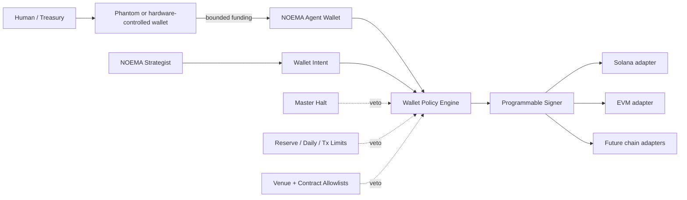
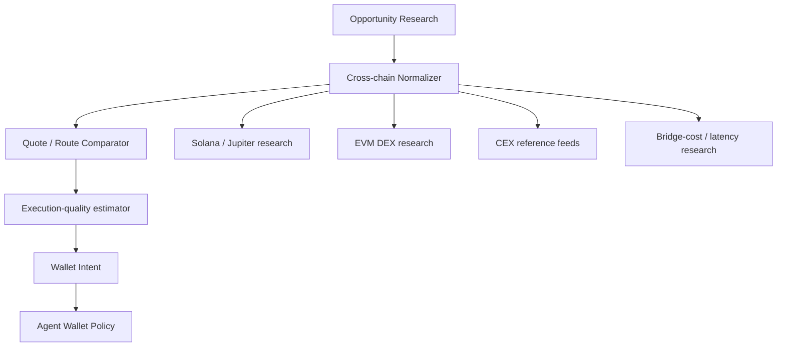

# NOEMA Agent Wallet Architecture

NOEMA should never use the owner's primary wallet seed as an unattended trading credential.

The recommended topology separates human treasury control from autonomous operating capital.


```mermaid
flowchart LR
    H[Human / Treasury] --> P[Phantom or hardware-controlled wallet]
    P -->|bounded funding| A[NOEMA Agent Wallet]
    A --> W[Wallet Policy Engine]
    W --> S[Programmable Signer]
    S --> C1[Solana adapter]
    S --> C2[EVM adapter]
    S --> C3[Future chain adapters]

    N[NOEMA Strategist] --> I[Wallet Intent]
    I --> W

    K[Master Halt] -. veto .-> W
    R[Reserve / Daily / Tx Limits] -. veto .-> W
    L[Venue + Contract Allowlists] -. veto .-> W
```

## Two-wallet model

### Treasury wallet

Purpose:

- human custody;
- deposits and withdrawals;
- long-term balances;
- emergency recovery;
- funding the agent wallet;
- receiving profits.

A Phantom wallet can serve this role well because it is visible to the user on desktop/mobile and supports multiple networks.

NOEMA does **not** need the treasury seed phrase.

### Agent wallet

Purpose:

- hold only bounded operating capital;
- sign transactions requested by NOEMA;
- enforce restrictions independently of the strategy;
- be replaceable without affecting treasury custody.

A programmable server-wallet provider with a policy engine is a better fit than exporting a Phantom private key into a server process.

## Why a programmable signer

The strategy and the signer should not share authority.

NOEMA may decide:

> swap $18 USDC into SOL on an allowlisted venue

but the signer should independently reject it when:

- the chain is not allowlisted;
- the venue is not allowlisted;
- the contract/program is unknown;
- size exceeds the per-transaction cap;
- daily turnover is exhausted;
- estimated slippage is too high;
- required reserve would be violated;
- no evidence references support the intent;
- the master halt is active.

This is defense in depth.

## Provider approach

The code uses a provider-neutral `WalletSigner` protocol.

Current intended roles:

| Provider | Role |
| --- | --- |
| Phantom | Human treasury / user-visible external wallet |
| Privy server wallet | Candidate autonomous signer with policy controls |
| Turnkey | Candidate autonomous signer / policy infrastructure |
| Local development signer | Testnet/dev only |

Provider selection should happen after testing current SDK/API support for the target chains.

## Local Phantom signer decision

NOEMA uses three distinct macOS login Keychain identities: Solana
(`com.noema.solana.owner-wallet` / `noema-owner`), EVM
(`com.noema.evm.owner-wallet` / `noema-owner`), and Bitcoin
(`com.noema.bitcoin.owner-wallet` / `noema-owner`). The EVM identity is shared by
Ethereum, Base and Polygon after an on-chain `eth_chainId` check. No credential is
copied to `.env.local`, SQLite, Docker, prompts, the dashboard or an ordinary agent
process. A short-lived signer child reads only the requested chain's Keychain item;
its parent receives structured public results only.

`WalletIntent` continues through `AgentWallet` and the deterministic policy into a
chain-specific signer. The owner-funded wallet balance is the capital boundary in
dedicated mode, so there is no routine approval click or daily discretionary cap.
The owner-controlled global and per-chain master halts remain outside model
authority, and each chain has an explicit signer-enable flag. Signers reject
unsupported actions, mismatched wallet identity, wrong chain ID, unavailable RPC,
failed simulation or preflight, insufficient native/token funds, and fees above the
intent ceiling.

Current adapters support native SOL transfers, native EVM transfers and standard
ERC-20 transfers, plus Bitcoin mainnet native-SegWit sends. Solana and EVM swaps,
arbitrary protocol calls, bridges and Bitcoin script types beyond native SegWit are
not enabled. A future adapter must decode a structured action, simulate or perform
an equivalent deterministic preflight, and reconcile its chain receipt before it
can be called a supported action.

### Current state

- Confirmed public identities are checked against their isolated Keychain items;
  the Home reads current public balances and chain IDs without returning any key.
- Solana and Base transaction construction, fee/gas estimation, simulation and
  local signing were verified without broadcasting. Solana simulation succeeded;
  Base `eth_call` and `eth_estimateGas` succeeded.
- Base ERC-20 holdings are read from the Base Blockscout token-balance index. It
  reported no tokens for the confirmed account. Other EVM chains support direct
  `balanceOf` reads for explicitly supplied token contracts.
- Bitcoin balance is zero, so there are no confirmed UTXOs to construct or sign a
  spend. Bitcoin does not have an EVM-style transaction simulation RPC; the adapter
  uses confirmed-UTXO and fee preflight instead.
- EVM and Solana broadcast, receipt confirmation and reconciliation paths are
  implemented, but no mainnet transaction has been broadcast. All signer-enable
  flags are off and the owner master halt is on. No live execution is available
  until the owner enables it after reviewing the runtime configuration.
- A confirmed transaction records its chain, public transaction reference, status,
  fee and balance reconciliation in the economic ledger and its owning mission;
  transfers and fees are never classified as revenue.

## Current agent policy

The ordinary wallet policy stays fail-closed. The dedicated-wallet policy uses the
deposited wallet capital as its economic ceiling and retains:

- master halt **ON**;
- evidence required;
- explicit supported-chain and supported-action validation;
- per-intent fee ceilings and on-chain balance checks;
- per-chain signer-enable flags;
- a global owner-controlled master halt.

`DisabledWalletSigner` remains the default when no local owner signer is selected.

## Wallet intent

Strategies do not sign transactions directly.

They produce a structured `WalletIntent`:

```text
intent id
chain
venue
action
asset in
asset out
USD notional
expected slippage
destination
contract/program
strategy id
evidence ids
```

That intent passes through the deterministic wallet policy before any signer backend sees it.

## Multichain trenching architecture

A later NOEMA multichain engine should use separate adapters:


```mermaid
flowchart TD
    R[Opportunity Research]
    R --> X[Cross-chain Normalizer]
    X --> Q[Quote / Route Comparator]
    Q --> E[Execution-quality estimator]
    E --> I[Wallet Intent]
    I --> G[Agent Wallet Policy]

    X --> SOL[Solana / Jupiter research]
    X --> EVM[EVM DEX research]
    X --> CEX[CEX reference feeds]
    X --> BR[Bridge-cost / latency research]
```

Potential research features:

- cross-venue price dislocation;
- pool depth;
- route price impact;
- gas/priority fees;
- bridge cost and latency;
- liquidity migration;
- toxic flow;
- lead/lag;
- short-horizon momentum/reversion;
- wallet-flow changes;
- volatility regime;
- execution probability.

Each chain/venue remains a separate adapter. One generic "crypto trade" function should not control every venue.

## Capital topology

A strong default is:

```text
TREASURY
$X,XXX+

     │ deliberately fund
     ▼

AGENT WALLET
small bounded balance

     │ strategy intents
     ▼

PER-TX LIMIT
DAILY LIMIT
RESERVE FLOOR
ALLOWLISTS
SLIPPAGE CAP
MASTER HALT
```

If the agent wallet is compromised, the blast radius should be the bounded wallet—not the treasury.

## Autonomy

The goal is not to require a human click for every permitted action.

The goal is:

> autonomous decisions inside pre-authorized boundaries.

High-risk changes remain human-controlled:

- increasing wallet limits;
- changing signer ownership;
- adding new contracts;
- adding new chains;
- withdrawing to new destinations;
- disabling the master halt for the first time.

## Current status

Implemented:

- wallet descriptors and roles;
- multichain intent schema;
- deterministic wallet policy;
- daily budget ledger;
- provider-neutral signer protocol;
- isolated macOS Keychain signer process for Solana, EVM and Bitcoin;
- chain-ID checked EVM adapter for Ethereum, Base and Polygon;
- Solana simulation and native transfer signer;
- EVM native/ERC-20 construction, gas estimation, `eth_call`, signing, send and receipt reconciliation;
- Bitcoin native-SegWit UTXO/fee preflight, signing, broadcast and confirmation;
- wallet coordinator;
- economic and mission receipt persistence;
- read-only multi-chain wallet status in NOEMA Home;
- unit tests and live construction/simulation/signing checks.

Not yet implemented:

- DEX swap adapters and protocol-call allowlists;
- token registry and automatic ERC-20 discovery on Ethereum/Polygon;
- Bitcoin fee/UTXO transaction construction test (the confirmed account balance is zero);
- live mainnet broadcast/confirmation test (no economically justified live intent has been executed);
- USD valuation for wallet balance and on-chain fees.

Those should be added one adapter at a time against current provider documentation and testnets before mainnet capital is considered.
