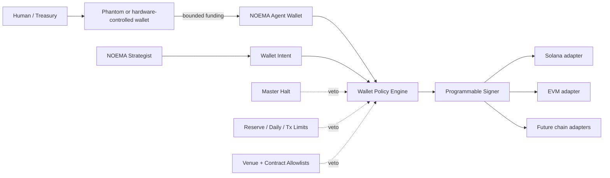
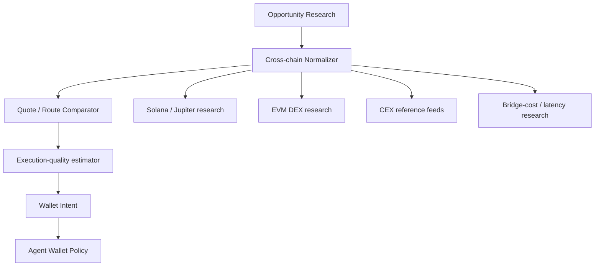

# NOEMA Agent Wallet Architecture

NOEMA should never use the owner's primary wallet seed as an unattended trading credential.

The recommended topology separates human treasury control from autonomous operating capital.


```mermaid
flowchart LR
    H[Human / Treasury] --> P[Phantom or hardware-controlled wallet]
    P -->|bounded funding| A[NOEMA Agent Wallet]
    A --> W[Wallet Policy Engine]
    W --> S[Programmable Signer]
    S --> C1[Solana adapter]
    S --> C2[EVM adapter]
    S --> C3[Future chain adapters]

    N[NOEMA Strategist] --> I[Wallet Intent]
    I --> W

    K[Master Halt] -. veto .-> W
    R[Reserve / Daily / Tx Limits] -. veto .-> W
    L[Venue + Contract Allowlists] -. veto .-> W
```

## Two-wallet model

### Treasury wallet

Purpose:

- human custody;
- deposits and withdrawals;
- long-term balances;
- emergency recovery;
- funding the agent wallet;
- receiving profits.

A Phantom wallet can serve this role well because it is visible to the user on desktop/mobile and supports multiple networks.

NOEMA does **not** need the treasury seed phrase.

### Agent wallet

Purpose:

- hold only bounded operating capital;
- sign transactions requested by NOEMA;
- enforce restrictions independently of the strategy;
- be replaceable without affecting treasury custody.

A programmable server-wallet provider with a policy engine is a better fit than exporting a Phantom private key into a server process.

## Why a programmable signer

The strategy and the signer should not share authority.

NOEMA may decide:

> swap $18 USDC into SOL on an allowlisted venue

but the signer should independently reject it when:

- the chain is not allowlisted;
- the venue is not allowlisted;
- the contract/program is unknown;
- size exceeds the per-transaction cap;
- daily turnover is exhausted;
- estimated slippage is too high;
- required reserve would be violated;
- no evidence references support the intent;
- the master halt is active.

This is defense in depth.

## Provider approach

The code uses a provider-neutral `WalletSigner` protocol.

Current intended roles:

| Provider | Role |
| --- | --- |
| Phantom | Human treasury / user-visible external wallet |
| Privy server wallet | Candidate autonomous signer with policy controls |
| Turnkey | Candidate autonomous signer / policy infrastructure |
| Local development signer | Testnet/dev only |

Provider selection should happen after testing current SDK/API support for the target chains.

### Current Phantom connection is observation-only

The `CONNECT PHANTOM` control in `noema/static/detailed.html` calls
`window.phantom.solana.connect()` in the browser and displays the returned public
key. It does not request a signature, build or submit a transaction, send the
address to the backend, or persist a wallet descriptor. It covers the Phantom
Solana provider only; it does not connect Phantom's EVM provider. Treat this as a
browser-local address connection, not an authenticated agent signer or as a
wallet identity currently available to the worker.

The backend's `PublicWalletObserver` is separately read-only and observes only
addresses configured through `NOEMA_SOLANA_WALLET_ADDRESS`, `NOEMA_EVM_ADDRESS`,
and `NOEMA_BITCOIN_ADDRESS`. A browser-connected Phantom address is not
automatically copied into those settings. Public balance reads do not require or
grant signing authority.

Phantom can be used as the human-controlled treasury interface, but it should
not be treated as an unattended server signer. Do not import its seed phrase or
private key into NOEMA. For autonomous operation, use a distinct, bounded agent
wallet controlled by a programmable signer, funded explicitly from the treasury.

## Local treasury signer (not Phantom or the agent wallet)

Local owner tooling uses three macOS login Keychain identities: Solana
(`com.noema.solana.owner-wallet` / `noema-owner`), EVM
(`com.noema.evm.owner-wallet` / `noema-owner`), and Bitcoin
(`com.noema.bitcoin.owner-wallet` / `noema-owner`). The EVM identity is shared by
Ethereum, Base and Polygon after an on-chain `eth_chainId` check. No credential is
copied to `.env.local`, SQLite, Docker, prompts, the dashboard or an ordinary agent
process. A short-lived signer child reads only the requested chain's Keychain item;
its parent receives structured public results only.

These are human-controlled credentials, not a provisioned agent wallet. The
`create_owner_agent_wallet` factory therefore uses `DisabledWalletSigner` and
`signer_isolated=False`; it cannot sign until a distinct agent wallet provider is
provisioned. `LocalOwnerWalletSigner` remains available only to explicit local
owner tooling and must not be attached to the autonomous coordinator.

After a separate agent wallet is provisioned, its `WalletIntent` must continue
through `AgentWallet` and deterministic policy into an isolated chain-specific
signer. Its explicitly authorized capital is the boundary; it must never inherit
Phantom or human Keychain signing authority. Global and per-chain halts remain
outside model authority, and each chain has an explicit signer-enable flag. Signers reject
unsupported actions, mismatched wallet identity, wrong chain ID, unavailable RPC,
failed simulation or preflight, insufficient native/token funds, and fees above the
intent ceiling.

Current adapters support native SOL transfers, native EVM transfers and standard
ERC-20 transfers, plus Bitcoin mainnet native-SegWit sends. Solana and EVM swaps,
arbitrary protocol calls, bridges and Bitcoin script types beyond native SegWit are
not enabled. A future adapter must decode a structured action, simulate or perform
an equivalent deterministic preflight, and reconcile its chain receipt before it
can be called a supported action.

### Current state

- Local tooling checks human Keychain identities against their derived public
  addresses. Public balance reads return no key. These identities are distinct
  from Phantom's browser-connected address and are not agent custody.
- Solana and Base transaction construction, fee/gas estimation, simulation and
  local signing were verified without broadcasting. Solana simulation succeeded;
  Base `eth_call` and `eth_estimateGas` succeeded.
- Base ERC-20 holdings are read from the Base Blockscout token-balance index. It
  reported no tokens for the confirmed account. Other EVM chains support direct
  `balanceOf` reads for explicitly supplied token contracts.
- Bitcoin balance is zero, so there are no confirmed UTXOs to construct or sign a
  spend. Bitcoin does not have an EVM-style transaction simulation RPC; the adapter
  uses confirmed-UTXO and fee preflight instead.
- Local owner signer adapters contain broadcast, receipt and reconciliation code,
  but the autonomous agent factory does not use them. No mainnet transaction has
  been broadcast. Agent signing remains disabled until a distinct isolated
  agent-wallet provider and owner-controlled policy are provisioned.
- A confirmed transaction records its chain, public transaction reference, status,
  fee and balance reconciliation in the economic ledger and its owning mission;
  transfers and fees are never classified as revenue.

## Dormant agent policy template

The policy template is not execution authority and is not currently paired with
an agent signer. The autonomous wallet factory always uses `DisabledWalletSigner`.
If a distinct agent custody provider is provisioned later, the policy must use its
explicitly funded balance as an economic ceiling and retain:

- master halt **ON**;
- evidence required;
- explicit supported-chain and supported-action validation;
- per-intent fee ceilings and on-chain balance checks;
- per-chain signer-enable flags;
- a global owner-controlled master halt.

`DisabledWalletSigner` is the only configured autonomous signer in the hosted
runtime. No environment flag or evidence score can enable a missing provider.

## Wallet intent

Strategies do not sign transactions directly.

They produce a structured `WalletIntent`:

```text
intent id
chain
venue
action
asset in
asset out
USD notional
expected slippage
destination
contract/program
strategy id
evidence ids
```

That intent passes through the deterministic wallet policy before any signer backend sees it.

## Multichain trenching architecture

A later NOEMA multichain engine should use separate adapters:


```mermaid
flowchart TD
    R[Opportunity Research]
    R --> X[Cross-chain Normalizer]
    X --> Q[Quote / Route Comparator]
    Q --> E[Execution-quality estimator]
    E --> I[Wallet Intent]
    I --> G[Agent Wallet Policy]

    X --> SOL[Solana / Jupiter research]
    X --> EVM[EVM DEX research]
    X --> CEX[CEX reference feeds]
    X --> BR[Bridge-cost / latency research]
```

Potential research features:

- cross-venue price dislocation;
- pool depth;
- route price impact;
- gas/priority fees;
- bridge cost and latency;
- liquidity migration;
- toxic flow;
- lead/lag;
- short-horizon momentum/reversion;
- wallet-flow changes;
- volatility regime;
- execution probability.

Each chain/venue remains a separate adapter. One generic "crypto trade" function should not control every venue.

## Capital topology

A strong default is:

```text
TREASURY
$X,XXX+

     │ deliberately fund
     ▼

AGENT WALLET
small bounded balance

     │ strategy intents
     ▼

PER-TX LIMIT
DAILY LIMIT
RESERVE FLOOR
ALLOWLISTS
SLIPPAGE CAP
MASTER HALT
```

If the agent wallet is compromised, the blast radius should be the bounded wallet—not the treasury.

## Autonomy

The goal is not to require a human click for every permitted action.

The goal is:

> autonomous decisions inside pre-authorized boundaries.

High-risk changes remain human-controlled:

- increasing wallet limits;
- changing signer ownership;
- adding new contracts;
- adding new chains;
- withdrawing to new destinations;
- disabling the master halt for the first time.

## Current status

Implemented:

- wallet descriptors and roles;
- multichain intent schema;
- deterministic wallet policy;
- daily budget ledger;
- provider-neutral signer protocol;
- isolated macOS Keychain signer processes for local human treasury tooling (not
  agent custody);
- chain-ID checked EVM adapter for Ethereum, Base and Polygon;
- Solana simulation and native transfer signer;
- EVM native/ERC-20 construction, gas estimation, `eth_call`, signing, send and receipt reconciliation;
- Bitcoin native-SegWit UTXO/fee preflight, signing, broadcast and confirmation;
- wallet coordinator;
- economic and mission receipt persistence;
- read-only multi-chain wallet status in NOEMA Home;
- local construction/simulation/signing checks without transaction broadcast.

Not yet implemented:

- DEX execution adapters and protocol-call allowlists (read-only quote research is now implemented; see below);
- token registry and automatic ERC-20 discovery on Ethereum/Polygon;
- Bitcoin fee/UTXO transaction construction test (the confirmed account balance is zero);
- live mainnet broadcast/confirmation test (no economically justified live intent has been executed);
- USD valuation for wallet balance and on-chain fees.

Those should be added one adapter at a time against current provider documentation and testnets before mainnet capital is considered.

## DEX route research status

`noema/dex_quotes.py` contains read-only Jupiter Swap V2 `/order` and 0x Swap API
v2 `/price` adapters, normalized quote evidence and local append-only SQLite
storage. The normalized record keeps Jupiter's selected router, returned fee
fields, and provider expiry metadata when present. It never stores Jupiter's
unsigned transaction or 0x calldata. The local TTL is an observation bound, not
the provider's actual expiry. The 0x `/price` response is indicative and is not
treated as simulation or a firm quote. This is route research only:
`simulation_status` is `not_run`, `live_execution_enabled` is always false, depth
is unknown unless an adapter provides it, and network costs are not valued in a
shared denomination. Gross output never becomes an economic winner while costs
are incomplete.

These adapters are not yet scheduled as autonomous specialist work and are not
yet presented in the console. No persistent specialist hypothesis/result loop,
quote-to-paper fill model, transaction receipt reconciliation, swap token-delta
accounting, or failed/partial swap P&L attribution is connected to them. The
local append store `dex_quote_observations` is ready for durable quote evidence,
but production database migration/retention and an evaluated sampling cadence
remain to be wired before continuous collection.

## DEX execution architecture direction

Use one normalized quote and execution-intent model across chains, with a
chain-specific route adapter behind it. For Solana research use Jupiter Swap API
V2; for Ethereum, Base, and Polygon use the 0x Swap API v2 chain-ID interface.
The current research adapter calls only quote/price endpoints. Execution paths
must remain separate and should not be implemented until evidence justifies
them and a remote isolated signer is provisioned.

The route service must not sign or submit. It should return a typed, expiring
route proposal bound to the exact wallet address, chain ID, input/output asset
identifiers, amount, minimum output, destination program/contracts, fee ceiling,
and source timestamp. The isolated signer verifies those fields again, simulates
the exact transaction, and independently enforces owner policy before any future
submission. Store confirmed receipts and reconcile actual token deltas,
gas/priority fees, and failed/reverted costs before attributing P&L. Do not treat
quote output as a fill or realized return.

The hosted Kalshi worker now verifies its private account endpoints successfully
on repeated cycles. Safe diagnostics report credential presence, endpoint failure
category and HTTP/network classification without exposing keys, signatures or
response bodies. The Polymarket sampler now reports private account failure
stage/classification independently from public market data; that code must be
deployed before hosted account/stream state can be verified. An authenticated
state is claimed only after read-only private account endpoints return
successfully.

References: [Jupiter Swap API](https://developers.jup.ag/docs/swap-api), [0x Swap API](https://docs.0x.org/docs/introduction/quickstart/swap-tokens-with-0x-swap-api), and [Privy wallet policies and controls](https://docs.privy.io/security/wallet-infrastructure/policy-and-controls). A server signer such as Privy or Turnkey still needs explicit wallet provisioning, owner-controlled policy, and service credentials; the enum value alone does not configure or authorize one.
