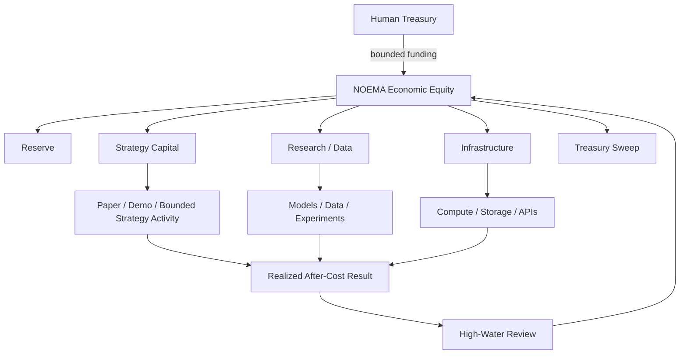
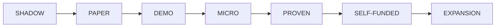

# NOEMA Economic Operating System

NOEMA's economic layer is designed around one principle:

> **Autonomy is earned from evidence, not granted because the agent sounds intelligent.**

The economic system does not move funds by itself. It maintains the capital map, autonomy level, budgets, high-water accounting, infrastructure proposals, and the limits that a separate wallet policy may enforce.

## Capital topology



## Starting capital

`economy-init` creates an **internal accounting snapshot**. It does not transfer money.

The conservative default partition is:

```text
50% reserve
40% strategy capital
10% research budget
 0% infrastructure
 0% treasury sweep
```

Those percentages are bookkeeping defaults, not recommended investment allocations.

## High-water accounting

Only equity above the previous economic high-water mark is treated as newly allocatable profit.

Example:

```text
high-water mark          $550
current economic equity  $600
-----------------------------
new allocatable profit    $50
```

Default planned waterfall:

```text
35% reserve
30% strategy capital
15% research
10% infrastructure
10% treasury sweep
```

The waterfall is a **plan first**. Applying the plan updates earmarks and advances the high-water mark so the same profit cannot be allocated twice.

## Operating expenses

Research and infrastructure expenses are economic costs.

When NOEMA spends an approved research/infrastructure budget:

- that bucket decreases;
- economic equity decreases;
- realized net economic P&L decreases.

The system therefore cannot claim profitability while silently ignoring compute, data, or server costs.

## Treasury sweeps

A treasury sweep moves previously earmarked value out of the agent economy.

It reduces agent economic equity but is not classified as a trading/operating loss.

This distinction matters for measuring strategy quality separately from owner withdrawals.

## Earned autonomy



Higher levels require the lower levels first.

The evidence ladder includes:

- resolved out-of-sample forecasts;
- days of live observation;
- after-cost return;
- realized net P&L;
- maximum drawdown;
- calibration error;
- account reconciliation quality;
- profitable vs losing operating days.

### Promotion

Promotion is intentionally slow:

> **at most one autonomy level per economic review.**

Even if the current evidence qualifies for a much higher level, the system must spend time operating at the intermediate level before another promotion review.

### Demotion

Demotion is immediate.

If evidence deteriorates enough to earn a lower level, NOEMA can drop multiple levels at once.

## Example level ceilings

These are conservative software defaults, not optimal trading sizes.

| Level | Per transaction | Daily notional | Minimum reserve |
| --- | ---: | ---: | ---: |
| Shadow | $0 | $0 | $0 |
| Paper | $0 | $0 | $0 |
| Demo | $0 | $0 | $0 |
| Micro | $5 | $20 | $100 |
| Proven | $15 | $75 | $150 |
| Self-funded | $25 | $150 | $200 |
| Expansion | $50 | $300 | $300 |

The **human-configured wallet ceiling always wins**. Earned autonomy can reduce a human limit, never silently raise it beyond the owner's configured cap.

The wallet master halt also remains independently authoritative.

## Loss contraction

The economic layer explicitly shrinks authority after losses.

Example software defaults:

```text
4% drawdown  -> risk x 0.50
7% drawdown  -> risk x 0.25
10% drawdown -> research-only

1.5% daily loss -> risk x 0.50
3% daily loss   -> halt risk for the day

3 losing days -> risk x 0.50
5 losing days -> research-only
```

This makes expansion asymmetric:

> freedom is earned slowly and removed quickly.

## Infrastructure fund

Infrastructure spending should compete like any other investment.

A proposal records:

- one-time cost;
- monthly cost;
- expected monthly value;
- evidence strength.

NOEMA computes an evidence-adjusted value/cost score and checks the available infrastructure budget.

A server/GPU/rack should therefore be justified by measured value such as:

- increased replay throughput;
- lower latency;
- more market coverage;
- better experiment throughput;
- lower cloud spend;
- demonstrably improved research output.

## Economic playground

The Economic OS is intentionally extensible.

Future budget classes can include:

- premium data;
- independent model/API budgets;
- storage;
- GPUs;
- dedicated VPS workers;
- colocated/low-latency infrastructure where appropriate;
- chain-specific RPCs;
- specialist research grants;
- bounty budgets for new strategy hypotheses.

The agent may propose how to use an earned budget, while deterministic policy decides whether the request is within the available economic envelope.

## Operator commands

Initialize internal accounting:

```bash
noema economy-init --capital 500
```

Inspect the economic state:

```bash
noema economy-show
```

The Ops Console also exposes the latest economic snapshot and profit plan.

## Standard

NOEMA's economic objective is not:

> maximize today's number of trades.

It is:

```text
SURVIVE
  -> LEARN
  -> PROVE EDGE
  -> EARN
  -> RETAIN
  -> REINVEST
  -> EXPAND
```

There is no guarantee that the loop becomes profitable. The purpose of the Economic OS is to prevent growth from being financed by self-deception.
