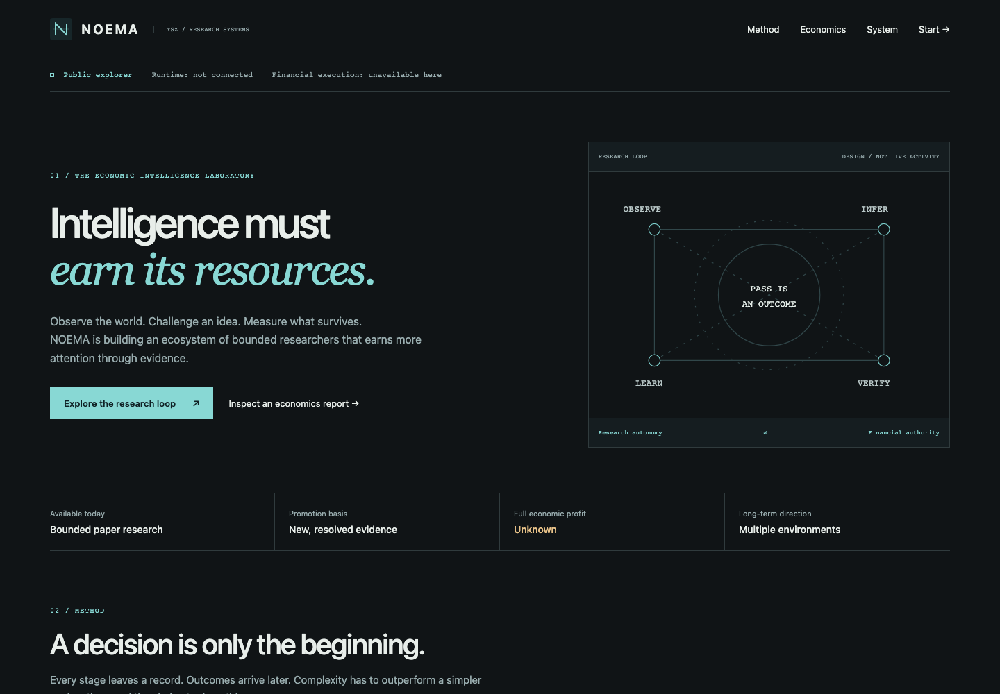

# Public experience validation — 2026-09-27

Base: `codex/economic-integrity` (PR #28). Economic engine semantics are unchanged.

## Implemented

Standalone public product experience, interactive lifecycle/specialist/architecture
inspection, explicit maturity and authority boundaries, Trench-1 chronology,
economic categories, local economics-report importer, onboarding, navigation, and
Pages CI. Existing operational documentation moved to an indexed operator guide.

Python package discovery now explicitly includes `noema` packages, preventing the
new site and Node tooling from breaking or entering Python distributions.

## Evidence

- Ruff: passed.
- Python: **360 passed**. One existing Starlette/httpx deprecation warning.
- Report importer: **20 passed**, including exact arithmetic, scientific notation,
  unsupported financial claims, invalid time/counts, size bounds, and hostile text.
- Wheel: built with `uv build --wheel`; runtime, venue adapter, and console assets
  present; public site and Node tooling excluded.
- Production Chromium: 390/768/1024/1440 px at `/NOEMA/` and custom-domain `/`.
  Interactive controls, disclosures, hash reload, keyboard skip, reduced motion,
  real Python report import, rejection retention, inert text, and clear/reload passed.
  No horizontal overflow, page/console errors, failed assets, or external requests.
- Shared bridge: built Meridian browser → Python NOEMA review → browser import;
  frozen question, reload recovery, tamper rejection, clear/file recovery passed.
- `git diff --check`: passed.

[Mobile screenshot](screenshots/public-mobile.png).

## Release boundaries

Pages API returned 404; the site is built and validated, not publicly deployed.
PR #28 has merged. Merge this feature into main; enable Pages Actions and run the
workflow. The public importer is unauthenticated and read-only; no runtime data or
financial authority is published. Full net economic profit remains unknown.
Docker execution, deployed worker health, and reconciliation were not verified by
this interface pass. See [production boundaries](production-boundaries.md).

## Operational console follow-up

The main FastAPI console now shows recorded work with no product explanation.
Existing diagnostics remain at `/detailed`. Added a bounded, column-allowlisted
read-only operational API, runtime/provider state, seven work record views,
exact-identity record links, filtering, inspector/backtracking and timed refresh
with explicit stale retention. Full economic profit remains unknown.

Five new Python regressions verify absent-DB noncreation, byte-for-byte database
nonmutation, row limits/private JSON exclusion, runtime freshness, corrupt-schema
handling and routing. Real FastAPI + temporary SQLite + Chromium checks at
390/768/1024/1440 verify record inspection, Back, safe text, filtering and failure
retention. The Python wheel includes the new HTML/CSS/module assets.
